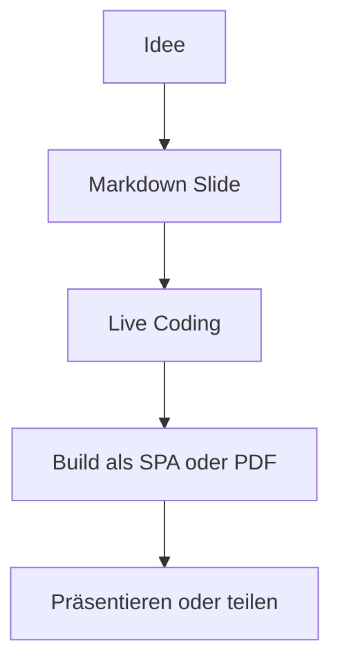

# Philipp Lein

Software Engineer, Product Builder, Deployment-Nerd

<div class="mt-8 grid grid-cols-[1.3fr_0.7fr] gap-6 items-center">
  <div>
    <p class="text-xl leading-8 opacity-90">
      Ich baue Produkte und Tooling, die Shipping schneller und Infrastruktur langweiliger machen.
    </p>
    <div class="mt-6 flex gap-3 flex-wrap text-sm">
      <span class="pill">DevBoost GmbH</span>
      <span class="pill">Open Source</span>
      <span class="pill">Kubernetes</span>
      <span class="pill">Django + TypeScript</span>
    </div>
  </div>
  <div class="profile-card">
    <div class="text-xs uppercase tracking-[0.25em] opacity-60">Leitsatz</div>
    <div class="mt-3 text-2xl font-bold">Explicit is better than implicit.</div>
  </div>
</div>

<div class="abs-br m-6 text-sm opacity-60">
  erstellt mit Slidev
</div>

---
layout: two-cols-header
---

# Wer ich bin

::left::

### Fokus

<v-clicks>

- Software Engineer mit starkem Produkt- und Plattform-Fokus
- Arbeitet gern an Developer Experience, Deployment und Automatisierung
- Baut nebenbei eigene Projekte von Community bis MMO

</v-clicks>

::right::

### Was mich antreibt

```ts
const motivation = {
  build: ['tools', 'products', 'systems'],
  optimizeFor: ['clarity', 'speed', 'boring deploys'],
  avoid: ['manual toil', 'fragile releases']
}
```

---
layout: image-right
image: https://images.unsplash.com/photo-1516321318423-f06f85e504b3?auto=format&fit=crop&w=1200&q=80
backgroundSize: cover
---

# Was ich gerade baue

### Deploy Your Startup

Open-Source CLI plus Kubernetes-basiertes Deployment-Framework, um Django-Startups von Null bis Production zu bringen.

```bash
uv tool install deploy-your-startup-cli
startup bootstrap
```

### Weitere Projekte

- `aboutphil.de`
- `gamingbuchclub.com`
- ein eigenes MMO als Langzeitprojekt

---
layout: center
class: text-center
---

# Mein Stack

<div class="mt-8 grid grid-cols-3 gap-4 text-left text-sm">
  <div class="stack-card">
    <div class="stack-title">Backend</div>
    <div>Python</div>
    <div>Django</div>
    <div>FastAPI</div>
    <div>TypeScript</div>
    <div>NestJS</div>
  </div>
  <div class="stack-card">
    <div class="stack-title">Frontend</div>
    <div>Vue.js</div>
    <div>JavaScript</div>
    <div>Bootstrap</div>
    <div>Markdown-first UI</div>
  </div>
  <div class="stack-card">
    <div class="stack-title">Infra</div>
    <div>Kubernetes</div>
    <div>Docker</div>
    <div>Terraform</div>
    <div>Ansible</div>
    <div>GitHub Actions</div>
  </div>
</div>

<div class="mt-8 text-sm opacity-70">
  Hetzner, DigitalOcean, Redis, Postgres und alles, was Deployments robuster macht.
</div>

---
layout: two-cols
---

# Was Slidev hier zeigt

- Markdown als Quelle
- Vue-Komponenten direkt in Slides
- Syntax Highlighting out of the box
- Layouts, Transitions und Presenter Mode
- Schnell genug fuer kleine Talks, Demos und interne Decks

::right::



---
layout: center
class: text-center
---

# Danke

### Philipp Lein

[GitHub](https://github.com/philipp-lein) · [LinkedIn](https://linkedin.com/in/philipp-lein) · [aboutphil.de](https://aboutphil.de)

<div class="mt-8 text-lg opacity-80">
  Nächster Schritt: <code>npm install</code> und dann <code>npm run dev</code>
</div>

<style>
h1 {
  background: linear-gradient(90deg, #dbeafe 0%, #60a5fa 40%, #c084fc 100%);
  -webkit-background-clip: text;
  background-clip: text;
  color: transparent;
}

.pill {
  border: 1px solid rgba(255, 255, 255, 0.16);
  border-radius: 999px;
  padding: 0.35rem 0.8rem;
  background: rgba(255, 255, 255, 0.05);
}

.profile-card,
.stack-card {
  border: 1px solid rgba(255, 255, 255, 0.12);
  background: rgba(255, 255, 255, 0.05);
  border-radius: 1rem;
  padding: 1.2rem;
  backdrop-filter: blur(10px);
}

.stack-title {
  font-size: 0.8rem;
  text-transform: uppercase;
  letter-spacing: 0.18em;
  opacity: 0.65;
  margin-bottom: 0.8rem;
}
</style>
